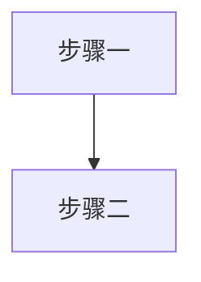

# 视觉资产生成策略

> 阶段4加载 | 封面/插图/Mermaid视觉资产策略
> 图表体系见 `templates.md` §八；排版规则见 `typography.md`；降级策略见 `build.md`

---

## §1 封面生成策略

### 三层路径

| 层级 | 方式 | 条件 | 说明 |
|------|------|------|------|
| **L1 内置AI图像生成封面** | **内置AI图像生成封面**——调用内置工具生成，直接保存到本地 | WorkBuddy内置图像生成可用（默认可用） | 最高品质，需审核 |
| **L2 SVG设计封面** | 在SVG文字封面上叠加装饰元素 | `visualPreset` 字段非空 | 自动生成，无外部依赖 |
| **L3 SVG文字封面** | 纯文字+渐变色块 | 兜底 | 现有默认方案 |

用户提供 `coverImage`（外部图片）时跳过以上三层，直接使用。

### 封面装饰×预设映射

| 预设 | visualPreset | 装饰元素 | 视觉意图 |
|------|-------------|---------|---------|
| 🅰 实战手册 | `geometric` | 几何线条网格 + 工具图标轮廓 | 系统化、可操作 |
| 🅱 创业指南 | `wave` | 波浪曲线 + 渐变色块过渡 | 动态、叙事感 |
| 🅲 行业白皮书 | `grid` | 数据网格 + 数据点装饰 | 严谨、数据驱动 |
| 🅳 咨询手册 | `bubble` | 对话气泡 + 连接线 | 对话、亲和力 |
| 🅴 技能教程 | `ladder` | 阶梯/层级色块 + 箭头 | 递进、成长感 |

### 封面图像生成提示词模板

**通用结构**：
```
[风格基调], book cover design, [书名主题关键词],
primary color [主色hex], accent color [辅色hex],
[构图描述], Chinese text space reserved at top center,
professional publishing quality, high resolution, no text, no watermark
```

**五预设变体**：

**🅰 实战手册**：
```
clean geometric style, professional handbook cover design,
[主题关键词], steel blue #2C5F7C and gold #D4A843 accents,
structured grid layout with abstract tool icon silhouettes,
modern minimalist, Chinese text space reserved at top center,
professional publishing quality, no text, no watermark
```

**🅱 创业指南**：
```
warm narrative style, entrepreneurship guide cover design,
[主题关键词], amber orange #E67E22 gradient to warm gold,
flowing curves and rising path metaphor, human figure silhouettes,
inspiring and approachable, Chinese text space reserved at top center,
professional publishing quality, no text, no watermark
```

**🅲 行业白皮书**：
```
data-driven professional style, industry whitepaper cover design,
[主题关键词], deep cyan blue #1A5276 with light blue accents,
abstract data visualization background with grid pattern and connection lines,
authoritative and analytical, Chinese text space reserved at top center,
professional publishing quality, no text, no watermark
```

**🅳 咨询手册**：
```
approachable dialogue style, consulting handbook cover design,
[主题关键词], olive green #27AE60 with warm neutral tones,
speech bubble decorative elements and human connection metaphor,
trustworthy and professional, Chinese text space reserved at top center,
professional publishing quality, no text, no watermark
```

**🅴 技能教程**：
```
clear progressive style, skill tutorial cover design,
[主题关键词], lavender purple #8E44AD with light violet accents,
ascending steps or layered blocks showing progression,
clear and structured, Chinese text space reserved at top center,
professional publishing quality, no text, no watermark
```

> **关键约束**：prompt 中始终包含 `no text`——AI生成图片中的中文极易出错，文字一律后期叠加。
> 竞品调研与设计趋势参见 `封面设计知识准备.md`。

---

## §2 插图生成策略

### 三类插图定义

| 类型 | 用途 | 尺寸建议 | 位置 |
|------|------|---------|------|
| **章首插图** | 章标题下方的氛围装饰图 | 宽幅 16:9，低饱和度 | h1 紧接处 |
| **概念插图** | 解释抽象概念的可视化 | 4:3，清晰背景 | 段落间居中 |
| **场景插图** | 案例/故事中的场景还原 | 4:3，叙事性 | 段落间居中 |

### Markdown标记语法

```markdown
<!-- ILLUST: chapter-header | prompt: [提示词] -->

<!-- ILLUST: concept | prompt: [提示词] | caption: 图X-Y：[说明] -->

<!-- ILLUST: scene | prompt: [提示词] | caption: 图X-Y：[说明] -->
```

写作时（阶段3）只需插入标记，不中断写作流。构建时（阶段4）根据路径处理。

### 三路径生成

| 路径 | 条件 | 产出 |
|------|------|------|
| **路径A 内置AI图像生成** | WorkBuddy内置图像生成可用（默认可用） | AI生成prompt → 调用内置工具生成 → 返回图片 → 嵌入MD |
| **路径B SVG抽象图** | 无内置AI图像生成，AI直接生成SVG | 几何抽象/图标组合SVG代码，嵌入MD |
| **路径C 占位降级** | 兜底 | 保留标记，构建时生成占位色块 + prompt文字 |

### 插图生成提示词模板

**章首插图**：
```
[插图风格关键词], wide banner illustration,
[章节核心主题], [书主色] color palette,
subtle and atmospheric, abstract background,
no text, no watermark, 16:9 aspect ratio,
suitable as chapter header decoration
```

**概念插图**：
```
[插图风格关键词], concept visualization,
[概念名称]: [视觉隐喻描述],
[书主色] color scheme, clean white background,
infographic aesthetic, clear and educational,
no text, no watermark, 4:3 aspect ratio
```

**场景插图**：
```
[插图风格关键词], scene illustration,
[场景描述]: [人物/环境/动作],
[书主色] color scheme, professional setting,
narrative and engaging, subtle details,
no text, no watermark, 4:3 aspect ratio
```

### 插图风格关键词（与预设对齐）

| 预设 | illustrationStyle | 关键词展开 |
|------|------------------|-----------|
| 🅰 实战手册 | `flat` | flat vector, geometric shapes, tool-focused, clean edges |
| 🅱 创业指南 | `watercolor` | warm watercolor, soft edges, human-centric, narrative |
| 🅲 行业白皮书 | `minimal` | minimal line art, data-driven, precise, monochrome accent |
| 🅳 咨询手册 | `line-art` | line art, conversational, approachable, hand-drawn feel |
| 🅴 技能教程 | `flat` | flat vector, step-by-step, progressive, vivid colors |

> **去AI味约束**：插图是内容的补充而非替代。每张插图必须提供文字无法传递的信息增量——"好看但无信息"的插图不合格。

---

## §3 Mermaid 配色注入规范

> 本节为 Mermaid 配色与节点约束的**唯一定义位置**。`templates.md` 骨架模板中的 `[book.color]` 占位符运行时从风格档案解析。

### 标准注入头（写入每个Mermaid代码块首行）

```
%%{init: {
  'theme': 'base',
  'themeVariables': {
    'primaryColor': '[book.color]',
    'primaryTextColor': '#ffffff',
    'primaryBorderColor': '[book.color]',
    'lineColor': '[book.color]88',
    'secondaryColor': '[book.lightBg]',
    'tertiaryColor': '[book.accentBg]',
    'fontFamily': 'Source Han Sans SC, Microsoft YaHei, SimHei, sans-serif'
  }
}}%%
```

将 `[book.color]` / `[book.lightBg]` / `[book.accentBg]` 替换为实际配色值。

### 节点标签约束

| 约束 | 规则 |
|------|------|
| **最大字数** | **单节点标签 ≤15 个汉字** |
| 换行 | 超长用 `<br/>` 分行：`["第一行<br/>第二行"]` |
| ID命名 | 英文ID + 中文标签：`A["用户需求分析"]` |
| 特殊字符 | 标签中的括号用引号包裹：`A["分析(初步)"]` |

### 图注约定

Mermaid 代码块后紧跟图注注释：
```markdown

<!-- FIG: 2-1：用户分析流程 -->
```

图注格式统一为 `图 X-Y：说明`（X=章号，Y=章内序号）。**插图与Mermaid图表共享编号序列**，按出现顺序连续编号。

---

## §4 视觉风格×五预设速查表

| 预设 | 主色 | 封面装饰 | Mermaid主色 | 插图风格 | 图表偏好 |
|------|------|---------|------------|---------|---------|
| 🅰 实战手册 | `#2C5F7C` | 几何线条 | `#2C5F7C` | flat, geometric | Mermaid流程图 |
| 🅱 创业指南 | `#E67E22` | 渐变波浪 | `#E67E22` | warm, watercolor | Mermaid时间线 |
| 🅲 行业白皮书 | `#1A5276` | 数据网格 | `#1A5276` | minimal, data | Mermaid+数据表 |
| 🅳 咨询手册 | `#27AE60` | 对话气泡 | `#27AE60` | line-art, conversational | Mermaid时序图 |
| 🅴 技能教程 | `#8E44AD` | 阶梯层级 | `#8E44AD` | flat, progressive | Mermaid步骤图 |

> 本表为速查；风格预设详见 `presets.md` §1，排版规则见 `typography.md`。
